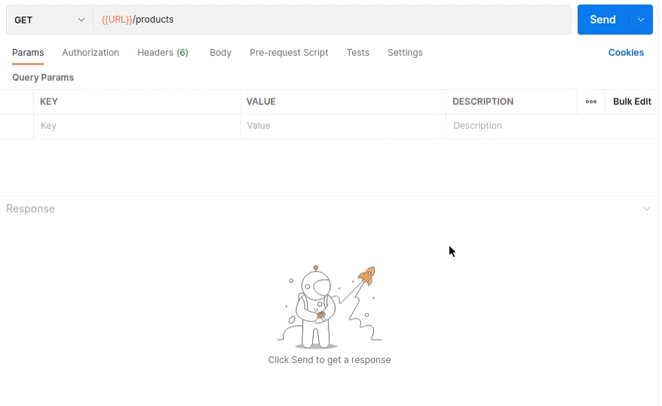
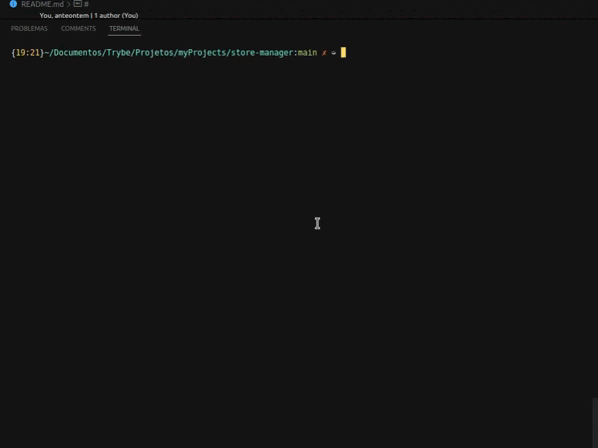

<div align="center"> 
    
</div>

<br>
<br>

<div align="center"> 
    
</div>

<br>
<br>

# Sumario
   - [Sobre](#sobre)
   - [Tecnologias](#tecnologias-utilizadas)
   - [Habilidades](#habilidades-desenvolvidas)
   - [Instruções](#instruções)
#

# Sobre

### Projeto desenvolvido enquanto estudante na [trybe](https://www.betrybe.com/formacao-desenvolvimento-web), Esse foi minha primeira API com arquitetura MSC(model, service, controller), a API se refere a um sistema de gerenciamento de vendas, foram implementadas 10 rotas, com diferentes funções, como deletar, atualizar e criar, cada rota conta com um ou alguns middlewares de verificação das regras de negocio, lançando diferentes tipos de status codes, o diferencial desse projeto foi foram a utilização de arquitetura MSC e a implementação de testes unitários.

#

# Tecnologias utilizadas
- [Postman](https://www.postman.com/)
- [MySQL Workbench](https://www.mysql.com/products/workbench/)
- [Node.js](https://nodejs.org/en/about/)
- [Mocha](https://mochajs.org/)
- [Chai](https://www.chaijs.com/)
- [sinon](https://sinonjs.org/)
- [express](https://expressjs.com/pt-br/)

#

# Habilidades desenvolvidas
- Entender o funcionamento da camada de Model;
- Delegar responsabilidades específicas para essa camada;
- Conectar sua aplicação com diferentes bancos de dados;
- Estruturar uma aplicação em camadas;
- Delegar responsabilidades específicas para cada parte do seu app;
- Melhorar manutenibilidade e reusabilidade do seu código;
- Entender e aplicar os padrões REST;
- Escrever assinaturas para APIs intuitivas e facilmente entendíveis.


#

# Instruções

```bash
    # Clonar repositório

    $ git clone git@github.com:furquin/store-manager.git

    # Entrar no diretório

    $ cd store-manager

    # Instalar dependências

    $ npm install

    # Criar banco de dados

    ### rode o código do arquivo StoreManger.sql em um visualizador de banco de dados sql

    # Iniciar a aplicação

    $ npm run debug

    # Realizar testes

    $ npm run test:mocha

    ### Acompanhe o arquivo Requisitos.txt para ajudar no entendimento da aplicação

```

<br>
<br>
<br>

### Desenvolvido por [Laert Furquin](https://github.com/furquin) 

